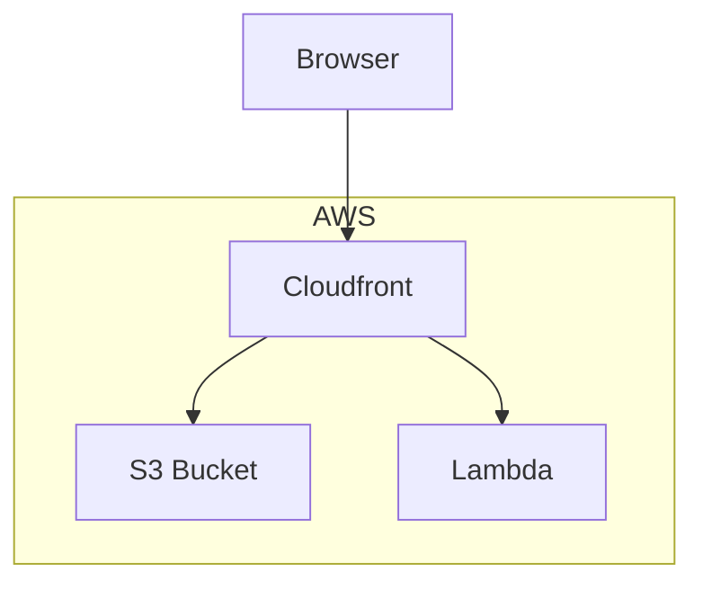

# Deployment overview



# API endpoints

```
localhost:4000/local/api/artists?query=stoned
localhost:4000/local/api/artists/7105/modules
localhost:4000/local/api/modules/146940
```

# TODO

- npm proxy to avoid CORS errors locally
- Use output from api as input to webui
